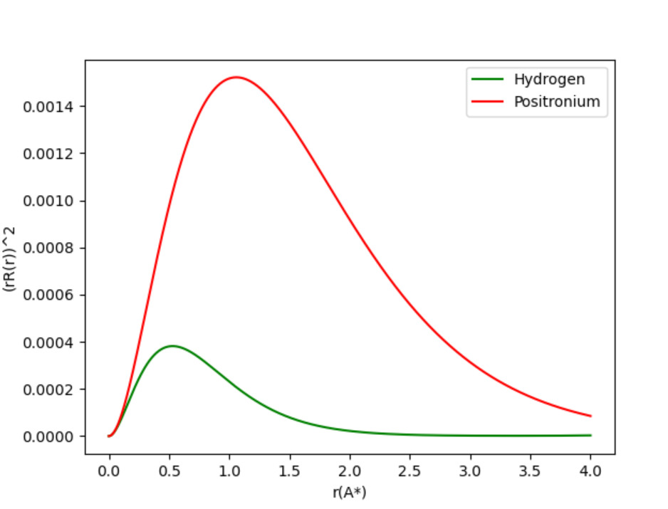
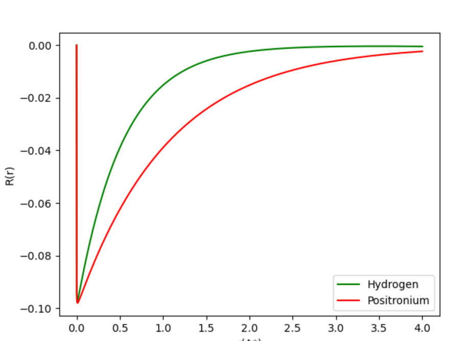
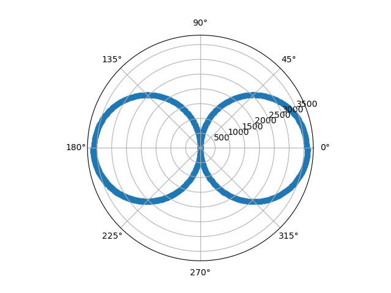
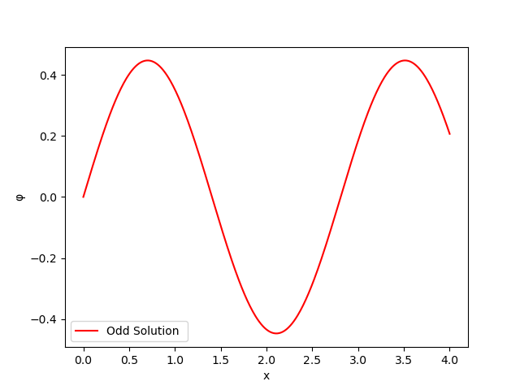
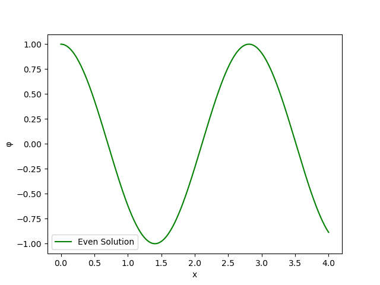
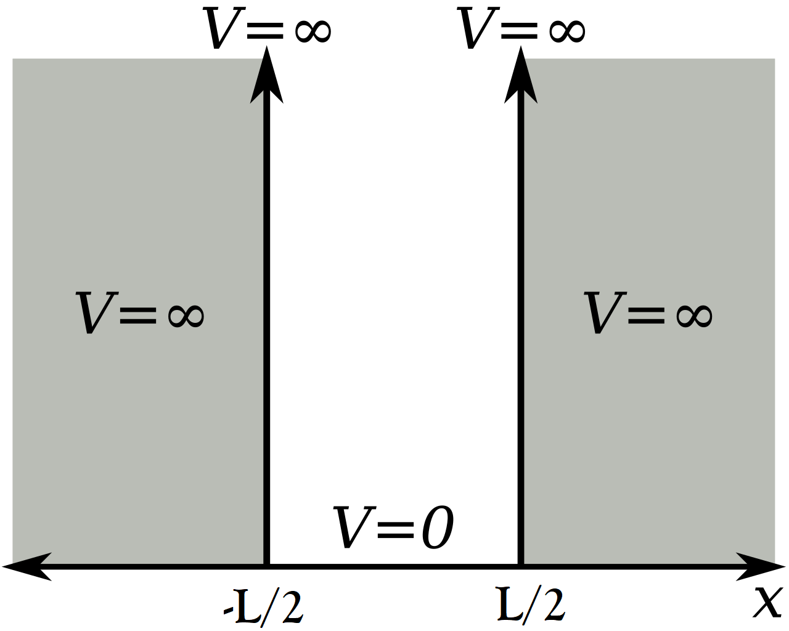
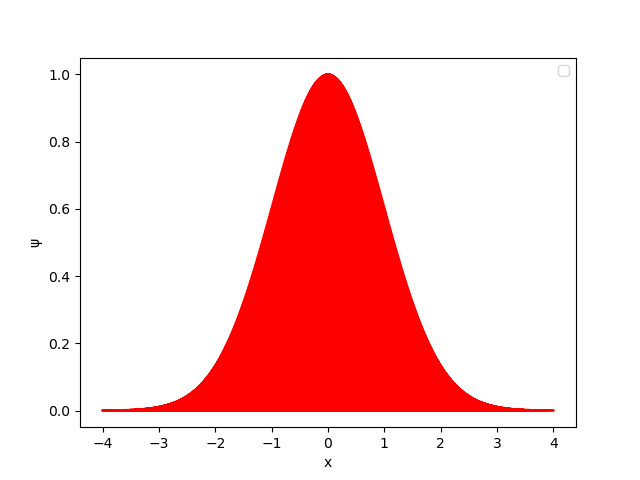
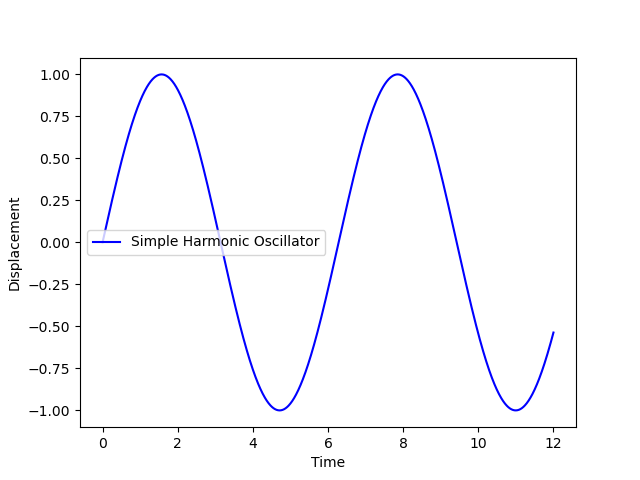
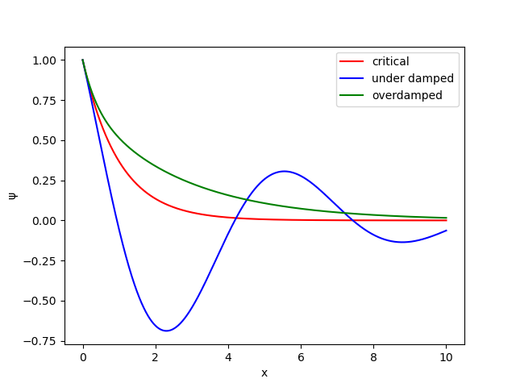

# Solution Of Schrodinger Equation For Hydrogen and Positronium Atoms

## Indian Institute Of Technology, Delhi

### CLL-113

### Numerical Methods In Chemical Engineering

---

### **Abstract:**

This paper has described the Schrodinger wave equation for the hydrogen and positronium atom.  Using the Runge-Kutta method of order 4, this was solved.  The numerical outcomes were discussed along with the graphs of probability and radial wave-function. The oscillator of quantum harmonic and infinite potential well have also been addressed well. Their energy eigenstates and wave functions have been obtained using the Runge-Kutta method of order 4. All the findings acquired   from the numerical approach are accurate in comparison to the analytical solutions. The Schrodinger equation is an integral part of quantum mechanics, and the RK4 method helps us in solving it in a more efficient manner.

---

### **Introduction:**

This paper is concerned with the numerical solutions of the radial Schrodinger wave equation for the hydrogen and positronium atoms using the Runge-Kutta method. Schrodinger equation is an important quantum mechanical equation yielding wave functions as its solution. It rarely becomes possible to solve this equation analytically; the Runge Kutta method is thus discussed in this paper to provide accurate numerical methods to such equations where no analytical counterpart exists.
The Runge-Kutta method of order 4 is a method of numerical integration based on the formalism of Euler , but with better precis to solve initial value problems.
As an extension, this approach is also discussed for two other quantum mechanical systems: the infinite potential well and the quantum harmonic oscillator to attain their energy eigenstates and corresponding wave functions from the Schrodinger equation. 
Harmonic oscillators often occur in classical mechanics, a pendulum (with small displacements), spring-mass systems, and electric current flow in a circuit, being a few examples. As an extension, these mechanical systems: the simple harmonic oscillator and damped free harmonic oscillator with no damping, are also discussed numerically using the RK4 method in the paper.

---

### Problem Formulation**:**

- **Assumptions:**

For hydrogen, reduced mass is defined as: 

Here, on dividing *u* by *mp:*

For this, the assumption is:

For ease of calculations, another assumption for infinite potential well is:

---

- **Equations Used and Boundary Conditions:**
    - **Schrodinger Equation:**

        <a href="https://www.codecogs.com/eqnedit.php?latex=\frac{1}{r^{2}}&space;\frac{\partial}{\partial&space;r}\left(r^{2}&space;\frac{\partial&space;\psi}{\partial&space;r}\right)&plus;\frac{1}{r^{2}&space;\sin&space;\theta}&space;\frac{\partial}{\partial&space;\theta}\left(\sin&space;\theta&space;\frac{\partial&space;\psi}{\partial&space;\theta}\right)&plus;\frac{1}{r^{2}&space;\sin&space;^{2}&space;\theta}&space;\frac{\partial^{2}&space;\psi}{\partial&space;\phi^{2}}&plus;\frac{2&space;m}{\hbar^{2}}(E-U)&space;\psi=0" target="_blank"></a>

    - **Schrodinger Equation for Radial Part:**

        

        - **Initial Values for Radial Part:**

        

    ---

    - **Schrodinger Equation for Angular Part:**

        <a href="https://www.codecogs.com/eqnedit.php?latex=\frac{\sin&space;^{2}&space;\theta}{R}&space;\frac{\partial}{\partial&space;r}\left(r^{2}&space;\frac{\partial&space;R}{\partial&space;r}\right)&plus;\frac{\sin&space;\theta}{\Theta}&space;\frac{\partial}{\partial&space;\theta}\left(\sin&space;\theta&space;\frac{\partial&space;\Theta}{\partial&space;\theta}\right)&plus;\frac{2&space;m&space;r^{2}&space;\sin&space;^{2}&space;\theta}{\hbar^{2}}\left(\frac{Z&space;e^{2}}{4&space;\pi&space;\epsilon_{0}&space;r}&plus;E\right)=-\frac{1}{\Phi}&space;\frac{\partial^{2}&space;\Phi}{\partial&space;\phi^{2}}" target="_blank"></a>

        - **Initial Values for Angular Part:**

        

        ---

    - **Equation for Infinite Well:**

        

        - **Boundary conditions for Infinite Well:**

        

        ---

    - **Equation for Harmonic Oscillator:**

        

        - **Boundary conditions for Harmonic Oscillator:**

        <a href="https://www.codecogs.com/eqnedit.php?latex=\psi(-L&space;/&space;2)=0,&space;\psi(&plus;L&space;/&space;2)=0,&space;E>0,&space;V(x=-L/2)=\infty,&space;V(x=L/2)=\infty" target="_blank">0,&space;V(x=-L/2)=\infty,&space;V(x=L/2)=\infty" title="\psi(-L / 2)=0, \psi(+L / 2)=0, E>0, V(x=-L/2)=\infty, V(x=L/2)=\infty" /></a>

    ---

    - **Equation for  Simple Harmonic Oscillator (Classical Model)**

        

        - **Boundary conditions for  Simple Harmonic Oscillator(Classical Model):**

        

    ---

    - **Equation for  Damped Harmonic Oscillator (Classical Model)**

        

        - **Boundary conditions for  Simple Harmonic Oscillator(Classical Model):**

        

        ---

- **Derivation of 4th order Runge-Kutta:**

Runge-Kutta is a method that is widely used to solve differential problems whose initial values are given. It is  a very efficient method as it does not require us to calculate the higher order derivatives of the function and solves the problems with high accuracy. There are Runge-Kutta methods that go upto the 10th order, but the most frequently used are the methods from order 1-5. We have more scope we have to increase the step size while maintaining the accuracy for higher order RK methods.

The derivation of Runge Kutta is based on Taylor series expansion which is written as:

For 4th order equation,  first four terms of Taylor series are used:

The Runge Kutta  Equation for a general '*s'* order can be written as:

where increments for *y* at *i*-th order are:

Here, the values of the constants are chosen as:

*y* can be defined **as:

<a href="https://www.codecogs.com/eqnedit.php?latex=\begin{array}{c}y_{t&plus;h}^{1}=y_{t}&plus;h&space;f\left(y_{t},&space;t\right)&space;\\y_{t&plus;h}^{2}=y_{t}&plus;h&space;f\left(y_{t&plus;h&space;/&space;2}^{1},&space;t&plus;\frac{h}{2}\right)&space;\\y_{t&plus;h}^{3}=y_{t}&plus;h&space;f\left(y_{t&plus;h&space;/&space;2}^{2},&space;t&plus;\frac{h}{2}\right)&space;\\\text&space;{&space;where&space;}&space;y_{t,&space;h&space;/&space;2}^{1}=\frac{y_{t}&plus;y_{t&plus;h}^{1}}{2}&space;\text&space;{&space;and&space;}&space;y_{t&plus;h&space;/&space;2}^{2}=\frac{y_{t}&plus;y_{t&plus;h}^{2}}{2}\end{array}" target="_blank"></a>

*k* can be defined as:

<a href="https://www.codecogs.com/eqnedit.php?latex=\begin{aligned}k_{2}&space;&=f\left(y_{t&plus;h&space;/&space;2}^{1},&space;t&plus;\frac{h}{2}\right)=f\left(y_{t}&plus;\frac{h}{2}&space;k_{1},&space;t&plus;\frac{h}{2}\right)&space;\\&=f\left(y_{t},&space;t\right)&plus;\frac{h}{2}&space;\frac{d}{d&space;t}&space;f\left(y_{t},&space;t\right)&space;\\k_{3}&space;&=f\left(y_{t&plus;h&space;/&space;2}^{2},&space;t&plus;\frac{h}{2}\right)=f\left(y_{t}&plus;\frac{h}{2}&space;f\left(y_{t}&plus;\frac{h}{2}&space;k_{1},&space;t&plus;\frac{h}{2}\right),&space;t&plus;\frac{h}{2}\right)&space;\\&=f\left(y_{t},&space;t\right)&plus;\frac{h}{2}&space;\frac{d}{d&space;t}\left[f\left(y_{t},&space;t\right)&plus;\frac{h}{2}&space;\frac{d}{d&space;t}&space;f\left(y_{t},&space;t\right)\right]&space;\\k_{4}&space;&=f\left(y_{t&plus;h}^{3},&space;t&plus;h\right)=f\left(y_{t}&plus;h&space;f\left(y_{t}&plus;\frac{h}{2}&space;k_{2},&space;t&plus;\frac{h}{2}\right),&space;t&plus;h\right)&space;\\&=f\left(y_{t}&plus;h&space;f\left(y_{t}&plus;\frac{h}{2}&space;f\left(y_{t}&plus;\frac{h}{2}&space;f\left(y_{t},&space;t\right),&space;t&plus;\frac{h}{2}\right),&space;t&plus;\frac{h}{2}\right),&space;t&plus;h\right)&space;\\&=f\left(y_{t},&space;t\right)&plus;h&space;\frac{d}{d&space;t}\left[f\left(y_{t},&space;t\right)&plus;\frac{h}{2}&space;\frac{d}{d&space;t}\left[f\left(y_{t},&space;t\right)&plus;\frac{h}{2}&space;\frac{d}{d&space;t}&space;f\left(y_{t},&space;t\right)\right]\right]\end{aligned}" target="_blank"></a>

Hence, substituting *k* in *y* gives:

<a href="https://www.codecogs.com/eqnedit.php?latex=\begin{aligned}y_{t&plus;h}=&&space;y_{t}&plus;h\left\{a&space;\cdot&space;f\left(y_{t},&space;t\right)&plus;b&space;\cdot\left[f\left(y_{t},&space;t\right)&plus;\frac{h}{2}&space;\frac{d}{d&space;t}&space;f\left(y_{t},&space;t\right)\right]&plus;\right.\\&&plus;c&space;\cdot\left[f\left(y_{t},&space;t\right)&plus;\frac{h}{2}&space;\frac{d}{d&space;t}\left[f\left(y_{t},&space;t\right)&plus;\frac{h}{2}&space;\frac{d}{d&space;t}&space;f\left(y_{t},&space;t\right)\right]\right]&plus;\\&\left.&plus;d&space;\cdot\left[f\left(y_{t},&space;t\right)&plus;h&space;\frac{d}{d&space;t}\left[f\left(y_{t},&space;t\right)&plus;\frac{h}{2}&space;\frac{d}{d&space;t}\left[f\left(y_{t},&space;t\right)&plus;\frac{h}{2}&space;\frac{d}{d&space;t}&space;f\left(y_{t},&space;t\right)\right]\right]\right]\right\}&plus;\mathcal{O}\left(h^{5}\right)&space;\\=&&space;y_{t}&plus;a&space;\cdot&space;h&space;f_{t}&plus;b&space;\cdot&space;h&space;f_{t}&plus;b&space;\cdot&space;\frac{h^{2}}{2}&space;\frac{d&space;f_{t}}{d&space;t}&plus;c&space;\cdot&space;h&space;f_{t}&plus;c&space;\cdot&space;\frac{h^{2}}{2}&space;\frac{d&space;f_{t}}{d&space;t}&plus;\\&&plus;c&space;\cdot&space;\frac{h^{3}}{4}&space;\frac{d^{2}&space;f_{t}}{d&space;t^{2}}&plus;d&space;\cdot&space;h&space;f_{t}&plus;d&space;\cdot&space;h^{2}&space;\frac{d&space;f_{t}}{d&space;t}&plus;d&space;\cdot&space;\frac{h^{3}}{2}&space;\frac{d^{2}&space;f_{t}}{d&space;t^{2}}&plus;d&space;\cdot&space;\frac{h^{4}}{4}&space;\frac{d^{3}&space;f_{t}}{d&space;t^{3}}&plus;\mathcal{O}\left(h^{5}\right)\end{aligned}" target="_blank"></a>

Comparing the above equation to Taylor's series expansion for first four terms:

which gives the final result as:

where:

---

### **Numerical Analysis:**

- **Numerical Analysis of  Radial Schrodinger Equation:**

The final formulas for a fourth order Runge-Kutta equation are:

<a href="https://www.codecogs.com/eqnedit.php?latex=\begin{aligned}\Delta&space;y^{(1)}&space;&=h&space;f\left(x_{i},&space;y_{i},&space;z_{i}\right)&space;\\\Delta&space;z^{(1)}&space;&=h&space;g\left(x_{i},&space;y_{i},&space;z_{i}\right)&space;\\\Delta&space;y^{(2)}&space;&=h&space;f\left(x_{i}&plus;\frac{h}{2},&space;y_{i}&plus;\frac{\Delta&space;y^{1}}{2},&space;z_{i}&plus;\frac{\Delta&space;z^{1}}{2}\right)&space;\\\Delta&space;z^{(2)}&space;&=h&space;g\left(x_{i}&plus;\frac{h}{2},&space;y_{i}&plus;\frac{\Delta&space;y^{1}}{2},&space;z_{i}&plus;\frac{\Delta&space;z^{1}}{2}\right)&space;\\\Delta&space;y^{(3)}&space;&=h&space;f\left(x_{i}&plus;\frac{h}{2},&space;y_{i}&plus;\frac{\Delta&space;y^{2}}{2},&space;z_{i}&plus;\frac{\Delta&space;z^{2}}{2}\right)&space;\\\Delta&space;z^{(3)}&space;&=h&space;g\left(x_{i}&plus;\frac{h}{2},&space;y_{i}&plus;\frac{\Delta&space;y^{2}}{2},&space;z_{i}&plus;\frac{\Delta&space;z^{2}}{2}\right)&space;\\\Delta&space;y^{(4)}&space;&=h&space;f\left(x_{i}&plus;\frac{h}{2},&space;y_{i}&plus;\frac{\Delta&space;y^{3}}{2},&space;z_{i}&plus;\frac{\Delta&space;z^{3}}{2}\right)&space;\\\Delta&space;z^{(4)}&space;&=h&space;g\left(x_{i}&plus;\frac{h}{2},&space;y_{i}&plus;\frac{\Delta&space;y^{3}}{2},&space;z_{i}&plus;\frac{\Delta&space;z^{3}}{2}\right)\end{aligned}" target="_blank"></a>

The incrementation done after  each iteration is as follows:

The application of the above formulas in the Schrodinger equation is done as given below.

The above equations are then simplified to:

where  

<a href="https://www.codecogs.com/eqnedit.php?latex=\begin{array}{l}&space;k_{1}=h&space;f\left(x_{0},&space;y_{0},&space;z_{0}\right)&space;\\&space;l_{1}=h&space;g\left(x_{0},&space;y_{0},&space;z_{0}\right)&space;\\&space;k_{2}=h&space;f\left(x_{0}&plus;\frac{h}{2},&space;y_{0}&plus;\frac{k_{1}}{2},&space;z_{0}&plus;\frac{l_{1}}{2}\right)&space;\\&space;l_{2}=h&space;g\left(x_{0}&plus;\frac{h}{2},&space;y_{0}&plus;\frac{k_{1}}{2},&space;z_{0}&plus;\frac{l_{1}}{2}\right)&space;\\&space;k_{3}=hf\left(x_{0}&plus;\frac{h}{2},&space;y_{0}&plus;\frac{k_{2}}{2},&space;z_{0}&plus;\frac{l_{2}}{2}\right)&space;\\&space;l_{3}=hg&space;\left(x_{0}&plus;\frac{h}{2},&space;y_{0}&plus;\frac{k_{2}}{2},&space;z_{0}&plus;\frac{l_{2}}{2}\right)&space;\\&space;x_{4}=h&space;f\left(x_{0}&plus;h,&space;y_{0}&plus;k_{3},&space;z_{0}&plus;l_{3}\right)\\&space;l_{4}=hg&space;\left(x_{0}&plus;{h},&space;y_{0}&plus;k_{3},&space;z_{0}&plus;l_{3}\right)&space;\\&space;\end{array}" target="_blank"></a>

The initial values taken are:

The standard values taken were:

---

- **Numerical Analysis for Angular Schrodinger Equation:**

The Schrodinger wave equation can be further written as:

Substituting the above expression and the potential into the spherical polar representation of the wave equation, we find, after some manipulation:

<a href="https://www.codecogs.com/eqnedit.php?latex=\frac{\sin&space;^{2}&space;\theta}{R}&space;\frac{\partial}{\partial&space;r}\left(r^{2}&space;\frac{\partial&space;R}{\partial&space;r}\right)&plus;\frac{\sin&space;\theta}{\Theta}&space;\frac{\partial}{\partial&space;\theta}\left(\sin&space;\theta&space;\frac{\partial&space;\Theta}{\partial&space;\theta}\right)&plus;\frac{2&space;m&space;r^{2}&space;\sin&space;^{2}&space;\theta}{\hbar^{2}}\left(\frac{Z&space;e^{2}}{4&space;\pi&space;\epsilon_{0}&space;r}&plus;E\right)=-\frac{1}{\Phi}&space;\frac{\partial^{2}&space;\Phi}{\partial&space;\phi^{2}}" target="_blank"></a>

which on further solving, can be reduced into equations dependent on theta and phi respectively as:

Solving these two equations analytically gives us the solution as shown below:

<a href="https://www.codecogs.com/eqnedit.php?latex=\begin{array}{lll}\ell&space;&&space;m_{\ell}&space;&&space;Y_{\ell&space;m_{l}}(\theta,&space;\phi)=\Theta_{\ell&space;m_{l}}(\theta)&space;\Phi_{m_{l}}(\phi)&space;\\0&space;&&space;0&space;&&space;(1&space;/&space;4&space;\pi)^{1&space;/&space;2}&space;\\1&space;&&space;0&space;&&space;(3&space;/&space;4&space;\pi)^{1&space;/&space;2}&space;\cos&space;\theta&space;\\1&space;&&space;\pm&space;1&space;&&space;\mp(3&space;/&space;8&space;\pi)^{1&space;/&space;2}&space;\sin&space;\theta&space;e^{\pm&space;i&space;\phi}&space;\\2&space;&&space;0&space;&&space;(5&space;/&space;16&space;\pi)^{1&space;/&space;2}\left(3&space;\cos&space;^{2}&space;\theta-1\right)&space;\\2&space;&&space;\pm&space;1&space;&&space;\mp(15&space;/&space;8&space;\pi)^{1&space;/&space;2}&space;\sin&space;\theta&space;\cos&space;\theta&space;e^{\pm&space;i&space;\phi}&space;\\2&space;&&space;\pm&space;2&space;&&space;(15&space;/&space;32&space;\pi)^{1&space;/&space;2}&space;\sin&space;^{2}&space;\theta&space;e^{\pm&space;2&space;i&space;\phi}\end{array}" target="_blank"></a>

In this term paper, the angular part of the Schrodinger wave function is numerically calculated for the p(z) orbital, using the RK4 method. The IVP solved for such a system is :- 

The  initial values taken were:

---

- **Numerical Analysis for Infinite Potential Well problem:**

A particle is trapped between two regions of infinite potential. The wave function outside the well is zero and it does not jump at it's boundaries.  The Schrodinger equation for such a system is as follows.:-

For ease of calculations,

Boundary conditions:-

<a href="https://www.codecogs.com/eqnedit.php?latex=\psi(-L&space;/&space;2)=0,&space;\psi(&plus;L&space;/&space;2)=0,&space;E>0" target="_blank">0" title="\psi(-L / 2)=0, \psi(+L / 2)=0, E>0" /></a>

Since it is known that the solution to such a problem is symmetrical about the origin, it can be assumed that the wave functions assume the form of a sine or cosine curve, therefore 2 boundary conditions arise:

---

- **Numerical Analysis for Quantum Harmonic Oscillator:**

Solving the Schrodinger wave equation for simple harmonic oscillator, gives us the function that is proportional to x*e^-x^2, and the graph obtained by the RK4 method also shows such trend where it is 0 at x=0, and then it oscillates around it.  This graph which is obtained from the numerical method aligns with the analytical solution .

---

- **Numerical Analysis for Simple Harmonic Oscillator (Classical Model):**

---

- **Numerical Analysis for Damped Harmonic Oscillator (Classical Model):**

Solving the equation for Damped Oscillation gives us:

The roots of the characteristic equation are:

<a href="https://www.codecogs.com/eqnedit.php?latex=1.&space;\text&space;Over&space;Damped:&space;\&space;\&space;\&space;\gamma^{2}>4&space;k&space;m,&space;where\&space;\&space;\gamma&space;=&space;3\&space;\&space;for&space;\&space;\&space;m&space;=&space;1&space;kg" target="_blank">4&space;k&space;m,&space;where\&space;\&space;\gamma&space;=&space;3\&space;\&space;for&space;\&space;\&space;m&space;=&space;1&space;kg" title="1. \text Over Damped: \ \ \ \gamma^{2}>4 k m, where\ \ \gamma = 3\ \ for \ \ m = 1 kg" /></a>

where the general solution is:

where the general solution is:

where the general solution is:

---

### **Results:**

- **Result for  Radial Schrodinger Equation:**

According to the formula, potential energy is inversely proportional to *r* which leads the potential to infinity at small values of *r*. Based on this,  the initial value of *r* can be assumed as *10^-4*. As the value of *r* increases, the graph shows a drastic change in the values of the wave function, and this tells us about the rate of change of the wave function with respect to *r* i.e. the derivative to have a high value, which we have here taken as -1000. Then using trial and error, we calculate the value of initial energy for which the wave function comes out to be convergent. The initial energy value obtained for the ground state of hydrogen, i.e. l=0, is -13.6506eV and for the positronium atom, the value is -6.803eV. These values are consistent with those obtained by analytical calculations in quantum mechanics and modern physics.

Probability wave function obtained from the Runge Kutta method for the ground state wave function of hydrogen and positronium atom.

Radial wave function obtained from the Runge Kutta method for the ground state wave function of hydrogen and positronium atom.

The graphs obtained by the numerical method are consistent with those obtained using analytical methods. In the probability wave function graph, we can observe that the probability increases as we move further away from the nucleus, hits maximum at a point, and then starts decreasing. This is in line with the analytical observations which state that the probability density of an electron is very low when it is extremely close to the nucleus, is maximum at a certain distance, and decreases after that.  

The radial wave function is proportional to *r**e^-k*r* where k is a constant and that is also observed from the graph as at r=0, the function value is 0 and as we move away from the nucleus, it grows exponentially and then tends to a constant value zero at large values of r as e^-k*r* becomes very small.

---

- **Results for Angular Schrodinger Equation:**

Polar angle ranges from 0 to $pi$.

Angular wave function plot for wave orbital p(z) i.e. l=1 and m=0

The hydrogen 'p' orbitals correspond to $l =1$ and in such a system $m_{l}$  takes values -1,0,1. In this research paper, angular wave plot has been numerically calculated for  $m_l =0$ i.e. the $p_z$ orbital.  The 2-D angular plot obtained through numerical analysis closely resembles the cross-section of a $p$ orbital.  Since, the wave function is symmetrical about the azimuthal angle, rotating the above 2-dimensional plot about the (0-180) axis of symmetry, generates the analytically calculated dumbbell shaped p orbital.

The above numerically generated plot also guarantees the proportionality of the angular wave function to cosine of the polar angle, which is in agreement with the analytically obtained values of the Legendre polynomial for $p_z$. The plot also proves the existence of 1 nodal plane (90-270 ) in the plane.

---

- **Results for Infinite Potential Well:**

Wave function for Odd Solution

Wave Function for Even solution

Potential Diagram for a particle in a box

In an infinite well, the wave function exists from -L/2 to L/2 as the potential is infinite outside those boundaries. Solving the equation of the wave function by applying boundary conditions tells us that it is a sine or cosine wave. This can be observed in the graphs obtained by solving the infinite well problem using the RK4 method. The odd solution represents the curve of a sine wave whereas the even solution represents the solution of a cosine wave.

The energy eigen value for such a wave function is observed at E = 5.0. 

**Calculation of  Energy Eigen value:**

To calculate the Energy value, the loop for the calculation of wave solutions is started with an energy value of 0. The value of energy is incremented with a step size of 5.0. The algorithm terminates as soon as the value of the wave function state at L/2 reaches 10^(-5)  thereby being close to zero and satisfying the boundary equations for the Schrodinger equation. This value is used to calculate the wave function using the Runge Kutta implementation.

---

- **Results for Quantum Harmonic Oscillator:**

Wave function for the ground state of the Quantum Harmonic Oscillator

The graph above shows the wave function for the ground state of the Quantum Harmonic Oscillator. We can see that it's concentrated at the origin, which means the particle spends most of its time around the origin.  Also, the wave function is symmetric about the origin and this is seen for even-numbered energy states. We also get to observe that the graph which is obtained by the numerical solution is aligned with the analytical solution, hence the result is accurate. 

---

- **Results for Simple Harmonic Oscillator:**

Wave Function for a Simple Harmonic Oscillator

Solving the final equation for the harmonic wave function by incorporating the boundary values gives the solution where the wave function is proportional to x*e^*-x^2,* which can also be observed in the graph that is obtained through the RK4 numerical method. the function is 0 at x=0 and as x increases it reaches a maximum value and then back to zero after which it again goes to a minimum value, following such trend, the particle undergoes a simple harmonic motion. As it is not under any external non conservative force, the amplitude of the oscillation remains constant.

---

- **Result for Damped Harmonic Oscillator:**

Wave functions for critical, under-damped and over-damped oscillation

The graph above represents the wave function for under-damped, critical, and over-damped oscillation. These graphs are numerically solved by the RK4 method and they completely align with the solution we get analytically. 

The damping coefficient is greater than the undamped resonance frequency for the over-damped oscillation, and the damped oscillator will prompt it to approach zero amplitude, but gradually. The damping coefficient equals the undamped resonance frequency approaching zero amplitude quicker than the over-damped oscillator for systems in critical damping.

For a system with small damping, the period and frequency are almost equal to simple harmonic motion. However, the amplitude gradually decreases, which is the case of Under-damped oscillations. This occurs because the non-conservative damping force withdraws energy from the system, usually in the form of thermal energy. The above graph displays oscillation trends identical to the analytically obtained solutions with decreasing amplitude, indicating that the RK4 method gave accurate results.

---

### Conclusion:

This paper has implemented the Runge-Kutta method to solve the Schrodinger equation for a hydrogen and positronium atom. Runge - Kutta is a numerical method employed to solve differential equations effectively and precisely. This study's numerical results are in good accordance with analytical computations for the hydrogen atom results in modern physics and quantum mechanics. This method can also examine quantum systems with different potentials, such as an infinite well and a harmonic oscillator.

---

### **Path Forward:**

In the term paper, Schrodinger's equation for a ground-state hydrogen atom, for which l=o is solved. The code developed in the paper can be extended to solve for excited states of the hydrogen atom with l>0. This will change the Energy (*E*) and azimuthal quantum number (*l*) in the equation. Similarly, the code can also be used to calculate wave functions of atoms other than hydrogen and positronium.  The angular part for excited states and other atoms can also be similarly calculated using the code developed in the paper.

The code developed in this paper can be used to solve any second-order initial value problem occurring in nature. The f and g functions and the initial values will be changed suitably to numerically calculate solutions to any second-order ode.

- Scope of Improvement :-
While researching the topic we came across interesting research papers and original ideas. This led us to realize the scope of improvements in our methodology and codes developed :
    - For calculating the eigen values, we used brute force to assume an initial value and then increment it till the boundary conditions are achieved. We realized that this step can be improvised by incorporating the bisection method into our code and thus making it more efficient.
    - In cases where initial values of the problem statement do not exist, Newton Raphson method can be used to obtain  such values and then follow the common routine to solve the ODE using the RK4 method.
    - We also realized that methods with higher efficiency such as RK5 exist.

    ---

### **References:**

1. Ali Asghar Mowlav, Application of Runge-Kutta numerical methods to solve the Schrödinger equation for hydrogen and positronium atoms, International Journal of Recent Research and Applied Sciences, Volume 5, Pages 289-293, Year 2010
2. M. Sadeghi , F. Mohammadi and N. Aalipour, Numerical study of the radial Schrodinger Equation for Hydrogen atom using Legendre wavelet, Caspian Journal of Mathematical Sciences, Volume 8, Pages 35-42, Year 2019
3. Brigham Young University, Applied and Computational Mathematics Emphasis, IVP, Math 437, Volume 4, Year 2017
4. Neill Lambert, Numerical Solutions of Schrodinger’s Equation,TB2, Year 2001
5. Marie Christine, Solving The Stationary One Dimensional Schrodinger Equation With The Shooting Method, Bachelor Thesis, Vienna Institute of Technology, Year 2016
6. Qinghe Ming, Yanping Yang, and Yonglei Fang, An Optimized Runge-Kutta Method for the Numerical Solution of the Radial Schrodinger Equation, Mathematical Problems in Engineering Volume 2012, Article ID 867948, Year 2012
7. Prof. Sameer Sapra, CML100, Class notes

This paper has implemented the Runge-Kutta method to solve the Schrodinger equation for a hydrogen and positronium atom. Runge - Kutta is a numerical method employed to solve differential equations effectively and precisely. This study's numerical results are in good accordance with analytical computations for the hydrogen atom results in modern physics and quantum mechanics. This method can also examine quantum systems with different potentials, such as an infinite well and a harmonic oscillator.